<div align="center">

  

</div>

---

```bash
~/SrijanSuresh $ cat bio.txt
```

> *Builder of **interactive worlds**, distributed systems, and intelligent machines.*  
> *I think in **game loops**, architect in **microservices**, and train models that **actually ship**.*  
> *Chess taught me that the best strategy isn't the one that's fastest — it's the one that's inevitable.*

---

## `// GITHUB STATS`

<div align="center">


</div>

---
## `// STACK`

<div align="center">

| Domain | Tools |
|:---:|:---|
| `♛  gpu` | CUDA, CUTLASS/CuTe, Triton, WMMA, Nsight Compute |
| `♝  ml systems` | PyTorch internals (ATen), TensorFlow, ML compilers |
| `♜  systems` | C++, Go, Python, gRPC, Linux, Slurm |
| `♚  GAME DEV` | Unity · Unreal Engine · C# · GLSL |
| `♜  BACKEND` | Python · Node.js · REST · gRPC · PostgreSQL · Docker · K8s |
| `♛  ML / AI` | PyTorch · TensorFlow · Reinforcement Learning · CUDA |
| `♟  TOOLING` | Git · CI/CD · Redis · Kafka |
| `♞  also` | C#, Win32 API, Ghidra, Unity, React |

</div>

---

## `// CURRENT MATCH`

```
  ♔ [MERGED]   Tiled CUDA transpose kernel in PyTorch's eager copy path (#194310)
  ♞ [ACTIVE]   LLM-generated NPC dialogue injected live into Persona 5 Royal
  ♜ [ACTIVE]   Distributed systems in Go: gossip, failure detection, membership
  ♛ [ACTIVE]   ML compilers and GPU kernels, from tensor IR down to SASS
```
> ♔ Merged into PyTorch: [tiled CUDA transpose kernel #194310](https://github.com/pytorch/pytorch/pull/194310)
---

## `// WEAPONS OF CHOICE`

<div align="center">


</div>

---

## `// CONNECT`

> Open to collabs, game jams, research, and interesting problems.  
> **Pick your piece. Make your move.**

<div align="center">

[](https://github.com/SrijanSuresh)
[](https://linkedin.com/in/srijan-suresh)
[](mailto:srijansuresh@gmail.com)

<br/>

`♟ ♙ ♟ ♙ ♟ ♙ ♟ ♙ ♟ ♙ ♟ ♙ ♟ ♙ ♟ ♙`

</div>
